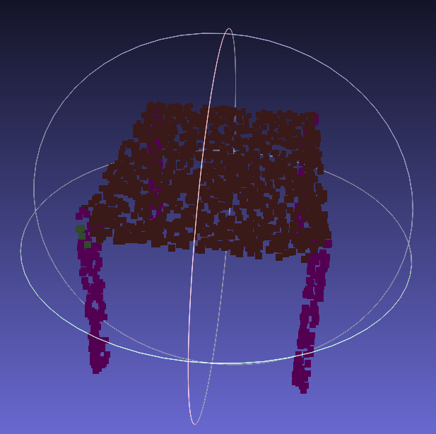
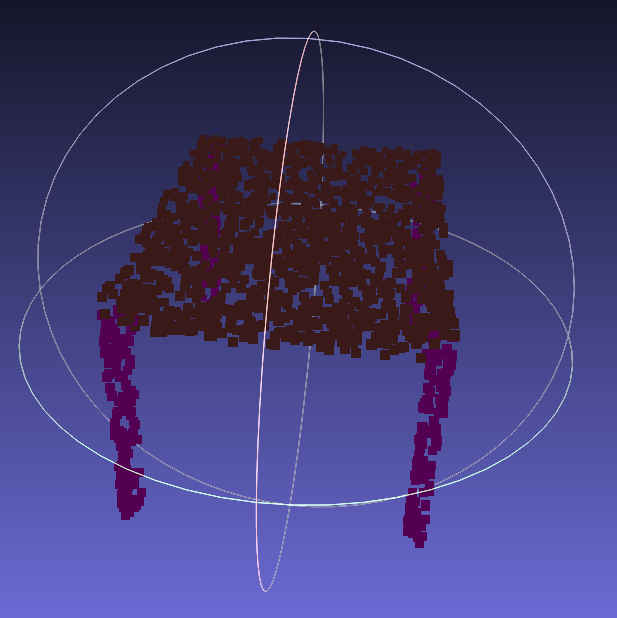
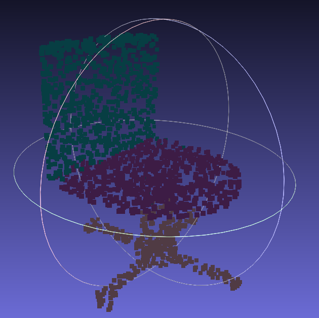
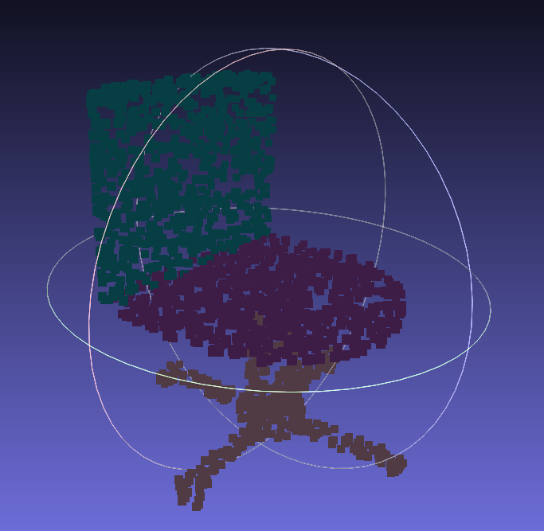

# Анализ методов сегментации облаков точек

В этом репозитории представлены данные сравнения нейросетевых архитектур в задаче сегментации облаков точек.

### Иссходные данные
1. Модели: [PointNet++](https://github.com/yanx27/Pointnet_Pointnet2_pytorch), [DGCNNv1](https://github.com/WangYueFt/dgcnn), [DGCNNv2](https://github.com/AnTao97/dgcnn.pytorch);
2. Среда: 
   1. Ubuntu 22.04 LTS x86_64;
   2. Cuda Version: 12.2;
   3. GPU: GPU Tesla T4 16 ГБ GDDR6.
3. Набор данных [ShapeNet](https://shapenet.cs.stanford.edu/media/shapenetcore_partanno_segmentation_benchmark_v0_normal.zip).


### DGCNNv1

Использовался код представленный в репозитории: https://github.com/WangYueFt/dgcnn

1.  Запуск тестирования
```bash
python main.py --exp_name=dgcnn_1024_eval --model=dgcnn --num_points=1024 --k=40 --use_sgd=True --eval=True --model_path=pretrained/model.1024.t7
```
Тестирование велось на предобученной [модели](https://github.com/WangYueFt/dgcnn/tree/master/pytorch/pretrained/model.1024.t7).

1. Результаты тестирования на [ShapeNet](https://shapenet.cs.stanford.edu/media/shapenetcore_partanno_segmentation_benchmark_v0_normal.zip).


| Test acc | Test avg acc | Mean IoU |
|-----------|--------|----------|
| 0.93      | 0.90   | 0.71    |

*для получения метрики Mean IoU, необходимо добавить функцию calculate_iou (заменить файл [main.py](https://github.com/WangYueFt/dgcnn/blob/master/pytorch/main.py) на обновленный [main.py](results/main.py) )

### DGCNNv2

Использовался код представленный в репозитории: https://github.com/antao97/dgcnn.pytorch.git

1.  Запуск тестирования
```bash
python main_partseg.py --exp_name=partseg_eval --eval=True --model_path=pretrained/model.partseg.t7 --visu=all --visu_format=ply
```
Тестирование велось на предобученной [модели](https://github.com/antao97/dgcnn.pytorch/tree/master/pretrained/model.partseg.t7).

2. Результаты тестирования на [ShapeNet](https://shapenet.cs.stanford.edu/media/shapenetcore_partanno_segmentation_benchmark_v0_normal.zip).

   
| Test acc | Test avg acc | Mean IoU |
|-----------|--------|----------|
| 0.94      | 0.83   | 0.85     |

3. Пример сегментации моделей

| Ground Truth (Table) | Predict | Ground Truth (Chair) | Predict |
|--------------|-----------------------|--------------|---------------------|
|  |  |  |  |


### PointNet++

Использовался код представленный в репозитории: https://github.com/yanx27/Pointnet_Pointnet2_pytorch

1.  Запуск тестирования
```bash
python test_partseg.py --normal --log_dir pointnet2_part_seg_msg 
```
Тестирование велось на предобученной [модели](https://github.com/yanx27/Pointnet_Pointnet2_pytorch/blob/master/log/part_seg/pointnet2_part_seg_msg/checkpoints/best_model.pth).

1. Результаты тестирования на [ShapeNet](https://shapenet.cs.stanford.edu/media/shapenetcore_partanno_segmentation_benchmark_v0_normal.zip).


| Test acc | Test avg acc | Mean IoU |
|-----------|--------|----------|
| 0.94      | 0.87   | 0.86    |


## Таблица метрик

| Метод    | Test acc | Test avg acc | Mean IoU |
|----------|-----------|--------|----------|
| PointNet++ | 0.94      | 0.87   | 0.86    |
| DGCNNv1    | 0.93      | 0.90   | 0.71    |
| DGCNNv2    | 0.94      | 0.83   | 0.85     |


## Результаты

Как видно из таблицы лучший результат по метрике mIoU на датасете [ShapeNet](https://shapenet.cs.stanford.edu/media/shapenetcore_partanno_segmentation_benchmark_v0_normal.zip) показал метод [PointNet++](https://github.com/yanx27/Pointnet_Pointnet2_pytorch). Можно прийти к выводу, что несмотря на то что подход DGCNN исспользует EdgeConv, за счет чего увеличиваются показатели характеризующие точность сегментации объекта, метод PointNet++ превосходит его на датасете [ShapeNet](https://shapenet.cs.stanford.edu/media/shapenetcore_partanno_segmentation_benchmark_v0_normal.zip). Однако результаты могут быть иными, в случае обучения сетей на одном датасете, так же, в связи с тем, что разница между метриками моделей PointNet++ и DGCNNv2 не велика, сеть DGCNNv2 может показать на реальных данных результат лучше. Что бы выбрать метод необходимо дальшейшее исследование включающе в себя тестирования на сетей на данных, которые будут близки к использующимся в задаче.


